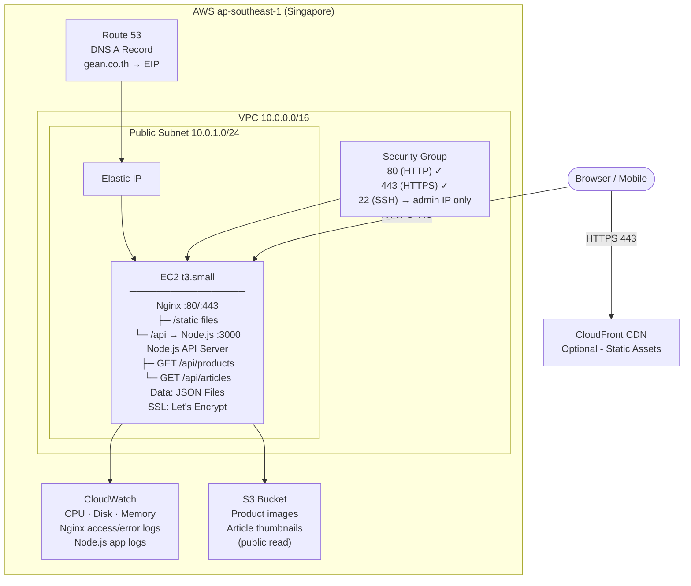

# GEAN — Solution Architecture Document

**Version:** 1.0  
**Scope:** Cloud infrastructure and deployment architecture for the GEAN brand website on AWS

---

## Table of Contents

1. [Overview](#1-overview)
2. [Architecture Diagram](#2-architecture-diagram)
3. [Infrastructure Components](#3-infrastructure-components)
4. [Deployment Architecture](#4-deployment-architecture)
5. [Network Architecture](#5-network-architecture)
6. [Scalability Considerations](#6-scalability-considerations)
7. [Security](#7-security)
8. [Monitoring & Logging](#8-monitoring--logging)
9. [Deployment Process](#9-deployment-process)
10. [Cost Estimation](#10-cost-estimation)

---

## 1. Overview

**GEAN** is a Thai hand cream brand website targeting modern office professionals. It is a bilingual (Thai/English) web application consisting of:

- **Frontend:** Multi-page web application (HTML, CSS, JavaScript) with eight screens — Home, Shop, Product Detail, Cart, Our Story, Article List, Article Detail, and Contact Us.
- **Backend API:** A lightweight REST API serving product catalog and article content as JSON. The frontend caches API responses in `localStorage` (1-hour TTL) to minimise server requests.
- **Ordering model:** No online checkout. Purchase is initiated by directing customers to LINE (`@gean.officially`).

The website is low-traffic (early-stage brand, single-SKU product), so the infrastructure prioritises **simplicity and cost-efficiency** over redundancy.

---

## 2. Architecture Diagram



**Request flow (simplified):**

```
Browser
  └─→ Route 53 (DNS)
        └─→ Elastic IP → EC2 Security Group → Nginx (443)
                  ├─→ /            → serve index.html + static assets
                  ├─→ /api/*       → proxy to Node.js :3000 → JSON response
                  └─→ /images/*    → redirect or proxy to S3
```

---

## 3. Infrastructure Components

| Component | AWS Service | Purpose |
|---|---|---|
| Compute | EC2 `t3.small` | Runs Nginx + Node.js API server |
| Static IP | Elastic IP | Fixed public IP bound to EC2 |
| DNS | Route 53 | Maps domain (e.g. `gean.co.th`) to Elastic IP |
| Object storage | S3 (1 bucket) | Stores product images and article thumbnails |
| Monitoring | CloudWatch | Metrics, alarms, and log aggregation |
| Networking | VPC + Public Subnet + Security Group | Network isolation and access control |
| SSL | Let's Encrypt (Certbot on EC2) | Free HTTPS certificate, auto-renewed |

**Services intentionally excluded:**
- RDS / DynamoDB — data volume is tiny; JSON files on disk are sufficient
- Load Balancer / Auto Scaling — single EC2 is adequate for current traffic
- ElastiCache — localStorage client-side caching handles repeat reads
- CloudFront CDN — can be added later if image load times become an issue

---

## 4. Deployment Architecture

### Application Stack on EC2

```
EC2 instance (Ubuntu 22.04 LTS)
│
├── Nginx 1.24
│   ├── Serves static files  →  /var/www/gean/public/
│   ├── Reverse proxy /api/* →  localhost:3000
│   └── SSL termination (Let's Encrypt certs via Certbot)
│
├── Node.js 20 LTS  (via nvm)
│   └── API Server (Express)  →  port 3000
│       ├── GET /api/products         → reads /data/products.json
│       ├── GET /api/articles         → reads /data/articles.json
│       └── GET /api/articles/:id     → reads /data/articles/:id.json
│
├── PM2 (process manager)
│   └── Keeps Node.js running, auto-restarts on crash, starts on reboot
│
└── /var/www/gean/
    ├── public/        ← static HTML, CSS, JS, fonts
    ├── api/           ← Node.js app (src, node_modules, package.json)
    └── data/          ← JSON content files (products, articles)
```

### Data Storage

Product catalog and article content are stored as flat JSON files on disk. This is appropriate because:
- The product catalog is tiny (1 active SKU + 2 coming-soon placeholders)
- Articles are editorial content updated infrequently
- No complex querying is required — the API returns the full list and the frontend filters client-side

To update content (add a product, publish an article), an admin edits the JSON file via SSH or a simple deploy script.

---

## 5. Network Architecture

### VPC Layout

```
VPC: 10.0.0.0/16  (ap-southeast-1)
│
└── Public Subnet: 10.0.1.0/24  (ap-southeast-1a)
    └── EC2 instance + Elastic IP
        (Internet Gateway attached to VPC)
```

A single public subnet is used. No private subnet is needed — there is no database server or internal service that should be shielded from the internet.

### Security Group Rules

**Inbound:**

| Port | Protocol | Source | Reason |
|---|---|---|---|
| 80 | TCP | 0.0.0.0/0 | HTTP (Nginx redirects to HTTPS) |
| 443 | TCP | 0.0.0.0/0 | HTTPS (web traffic) |
| 22 | TCP | Admin IP only | SSH admin access |

**Outbound:**

| Port | Protocol | Destination | Reason |
|---|---|---|---|
| All | All | 0.0.0.0/0 | Allow outbound (package updates, Let's Encrypt ACME, S3 API calls) |

### Network Flow

```
1. Browser requests https://gean.co.th
2. Route 53 resolves to Elastic IP
3. Security Group allows port 443 from internet
4. Nginx terminates TLS, serves static file or forwards to Node.js
5. Node.js reads local JSON file, returns JSON response
6. Browser caches response in localStorage (1-hour TTL)
```

---

## 6. Scalability Considerations

The current setup supports several thousand daily visitors on a `t3.small` without modification. If traffic grows, the following incremental steps can be taken **without redesigning** the architecture:

| Trigger | Action | Complexity |
|---|---|---|
| CPU > 70% sustained | Upgrade EC2 from `t3.small` → `t3.medium` or `t3.large` (stop, resize, start) | Low — 5 min downtime |
| More products / articles | Edit JSON files and redeploy | Minimal |
| Slow image delivery globally | Add CloudFront distribution in front of S3 bucket | Low |
| High image bandwidth cost | Serve images via CloudFront instead of direct S3 | Low |
| Need zero-downtime deploys | Add a second EC2 + Application Load Balancer + blue/green deploy | Medium |
| Multiple editors for content | Migrate JSON files to a headless CMS (e.g. Contentful, Strapi on same EC2) | Medium |

The architecture is designed so each of these steps can be adopted independently and only when the need arises.

---

## 7. Security

### SSL / TLS

- Let's Encrypt certificate issued via Certbot during server setup
- Nginx configured to redirect all HTTP (port 80) to HTTPS (port 443)
- Certificate auto-renewed via a cron job (`certbot renew --quiet`) — no manual intervention required
- TLS 1.2+ enforced; weak cipher suites disabled in Nginx config

### IAM

- EC2 instance has an **IAM Instance Role** (not access keys) with a scoped policy
- Role policy: `s3:GetObject` and `s3:PutObject` on the GEAN assets bucket only
- No root AWS credentials stored on the instance

### SSH Access

- Password authentication disabled on EC2; key-pair only
- SSH port 22 restricted to the admin's IP address in the Security Group
- `ec2-user` / `ubuntu` default user; no root login permitted

### S3 Bucket

- Bucket versioning enabled — accidental file overwrites can be recovered
- Product image files are public-read; no other permissions granted
- Bucket policy denies public write or delete

### Application Level

- Nginx serves only the `/var/www/gean/public/` directory — no directory listing
- Node.js API is not exposed directly; only accessible through Nginx reverse proxy on `/api/*`
- No user authentication data or payment data is collected by the site (ordering is via LINE)

---

## 8. Monitoring & Logging

### CloudWatch Metrics

The CloudWatch Agent is installed on EC2 and collects:

| Metric | Threshold for Alarm | Action |
|---|---|---|
| CPUUtilization | > 80% for 10 min | Email alert to admin |
| DiskSpaceUtilization | > 85% | Email alert to admin |
| MemoryUtilization | > 85% | Email alert to admin |
| StatusCheckFailed | ≥ 1 | Email alert to admin |

### Log Collection

| Log | Location on EC2 | Shipped to CloudWatch |
|---|---|---|
| Nginx access log | `/var/log/nginx/access.log` | Yes — Log Group `/gean/nginx/access` |
| Nginx error log | `/var/log/nginx/error.log` | Yes — Log Group `/gean/nginx/error` |
| Node.js app log (via PM2) | `/var/log/pm2/gean-api.log` | Yes — Log Group `/gean/app` |

Log retention is set to **30 days** in CloudWatch to control cost.

### Uptime Check

A CloudWatch Synthetics canary (or a free external service such as UptimeRobot) pings `https://gean.co.th` every 5 minutes and alerts on failure.

---

## 9. Deployment Process

### Initial Server Setup (one-time)

```bash
# 1. Launch EC2 t3.small, Ubuntu 22.04, attach Elastic IP
# 2. SSH in and run setup:

sudo apt update && sudo apt upgrade -y
sudo apt install nginx certbot python3-certbot-nginx -y
curl -o- https://raw.githubusercontent.com/nvm-sh/nvm/v0.39.7/install.sh | bash
nvm install 20
npm install -g pm2

# 3. Configure Nginx vhost (see config below)
# 4. Issue SSL cert
sudo certbot --nginx -d gean.co.th -d www.gean.co.th

# 5. Clone/upload app files
sudo mkdir -p /var/www/gean/{public,api,data}
# ... copy files ...

# 6. Install Node deps and start API
cd /var/www/gean/api && npm install
pm2 start server.js --name gean-api
pm2 startup && pm2 save

# 7. Install CloudWatch Agent
# ... follow AWS documentation ...
```

### Nginx Configuration (snippet)

```nginx
server {
    listen 443 ssl;
    server_name gean.co.th www.gean.co.th;

    ssl_certificate /etc/letsencrypt/live/gean.co.th/fullchain.pem;
    ssl_certificate_key /etc/letsencrypt/live/gean.co.th/privkey.pem;

    root /var/www/gean/public;
    index index.html;

    # Serve static pages
    location / {
        try_files $uri $uri.html $uri/ =404;
    }

    # Proxy API requests to Node.js
    location /api/ {
        proxy_pass http://localhost:3000;
        proxy_set_header Host $host;
        proxy_set_header X-Real-IP $remote_addr;
    }

    # Cache static assets aggressively
    location ~* \.(js|css|png|jpg|jpeg|gif|svg|woff2|ttf)$ {
        expires 30d;
        add_header Cache-Control "public, immutable";
    }
}

server {
    listen 80;
    server_name gean.co.th www.gean.co.th;
    return 301 https://$host$request_uri;
}
```

### Routine Code Deployment

```bash
# On developer machine — build and sync static files
rsync -avz --delete ./dist/ ubuntu@<EC2-IP>:/var/www/gean/public/

# Restart API if Node.js code changed
ssh ubuntu@<EC2-IP> "cd /var/www/gean/api && git pull && npm install && pm2 restart gean-api"
```

### Content Update (products / articles)

```bash
# Upload updated JSON file directly
scp ./data/products.json ubuntu@<EC2-IP>:/var/www/gean/data/products.json
# No restart required — Node.js reads the file on each request
```

### Deployment Checklist

- [ ] Test locally before deploying
- [ ] Back up `/var/www/gean/data/` before overwriting content files
- [ ] Verify `https://gean.co.th` loads correctly after deploy
- [ ] Check PM2 status: `pm2 status`
- [ ] Check Nginx: `sudo nginx -t && sudo systemctl status nginx`

---

## 10. Cost Estimation

All prices are approximate AWS `ap-southeast-1` (Singapore) on-demand rates as of mid-2025. Actual costs may vary.

### Monthly Breakdown

| Resource | Spec | Est. Monthly Cost (USD) |
|---|---|---|
| EC2 `t3.small` | 2 vCPU, 2 GB RAM — On-Demand | ~$18.00 |
| Elastic IP | 1 address (free while attached to running instance) | $0.00 |
| EBS gp3 volume | 20 GB root volume | ~$1.60 |
| S3 storage | ~2 GB images | ~$0.05 |
| S3 requests | ~50,000 GET/month | ~$0.02 |
| Route 53 | 1 hosted zone + queries | ~$0.60 |
| CloudWatch | Basic metrics + 3 log groups (30-day retention) | ~$2.00 |
| Data transfer out | ~10 GB/month | ~$0.90 |
| **Total** | | **~$23 / month** |

> **Note:** Switching to a **1-year Reserved Instance** for `t3.small` reduces EC2 cost from ~$18 to ~$10/month, bringing the total to approximately **$15/month**.

### Cost Optimisation Tips

- Use **t3.small Savings Plan or Reserved Instance** for a ~45% EC2 discount after the first month
- Enable **S3 Intelligent-Tiering** if image access patterns are irregular (negligible cost at current scale)
- Set CloudWatch log retention to 30 days (already specified above) — avoid accumulating months of logs
- The `t3.small` instance can be **stopped outside business hours** during development phase (saves ~$12/month)

### Cost if Traffic Grows 10×

Adding CloudFront in front of S3 for images costs ~$1–3/month extra and dramatically reduces EC2 bandwidth charges. An EC2 upgrade to `t3.medium` adds ~$18/month. Total would remain under **$50/month** for 10× current traffic.
