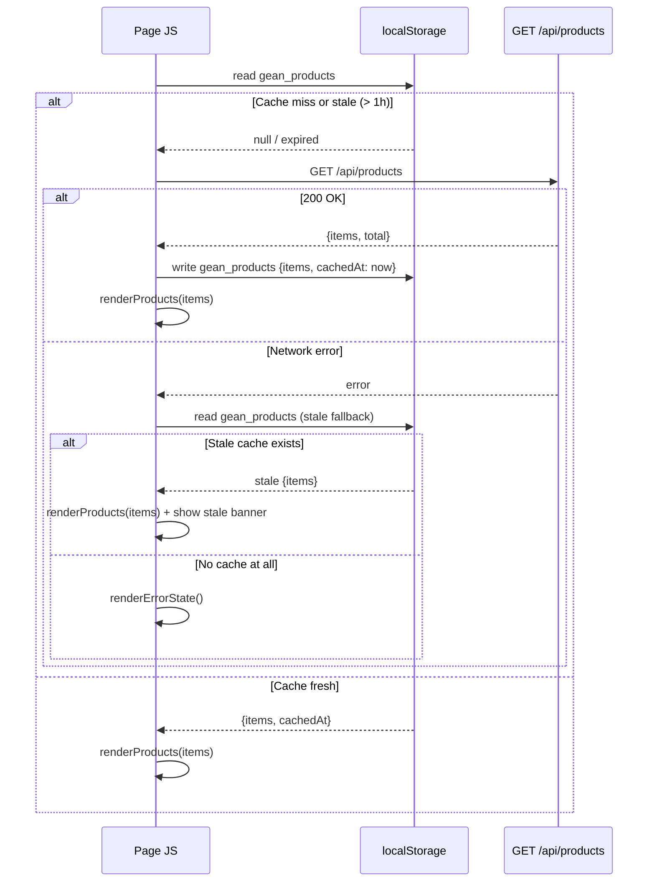
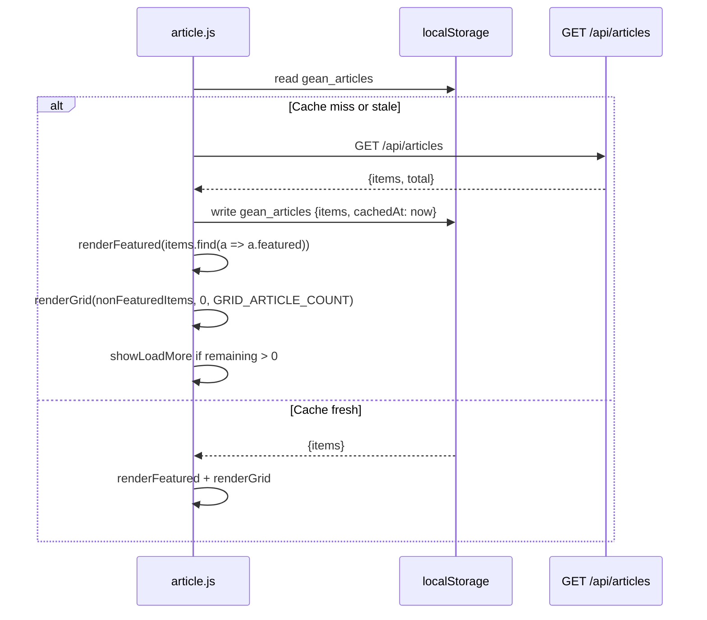
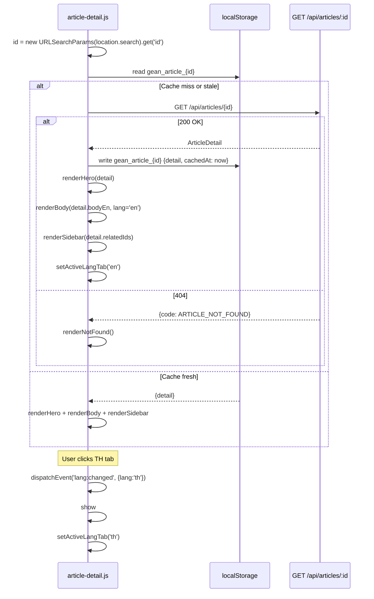
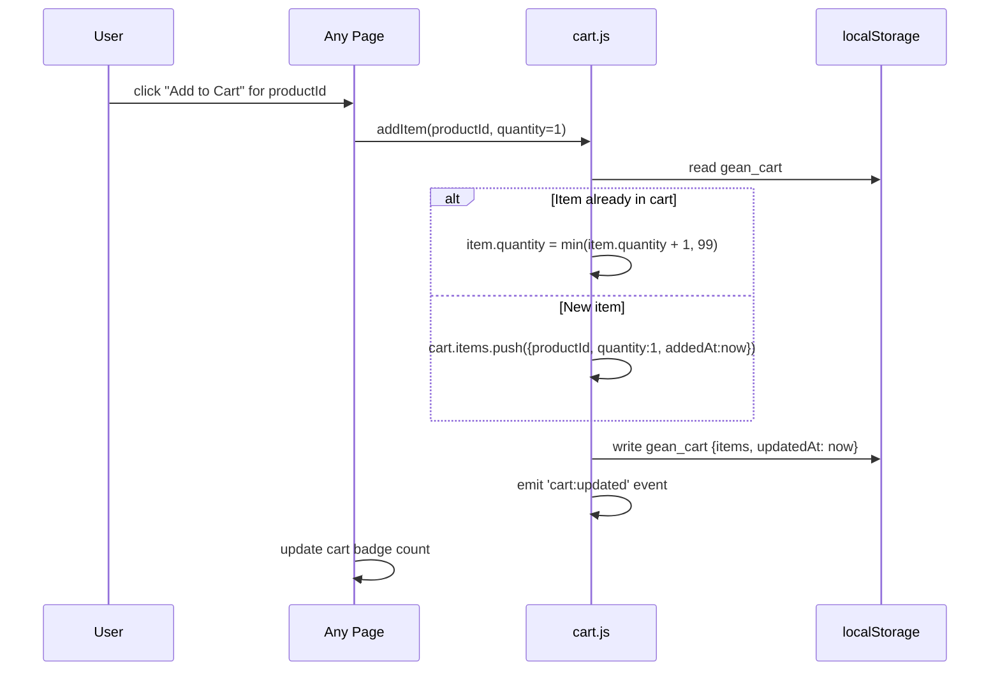
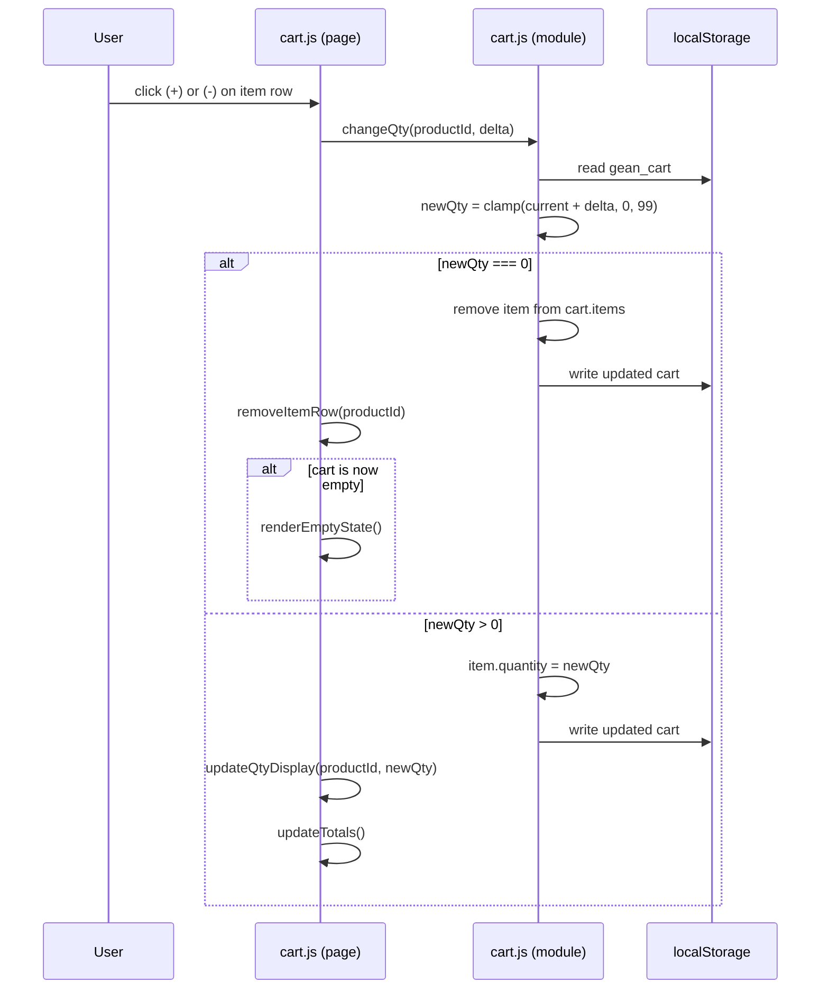
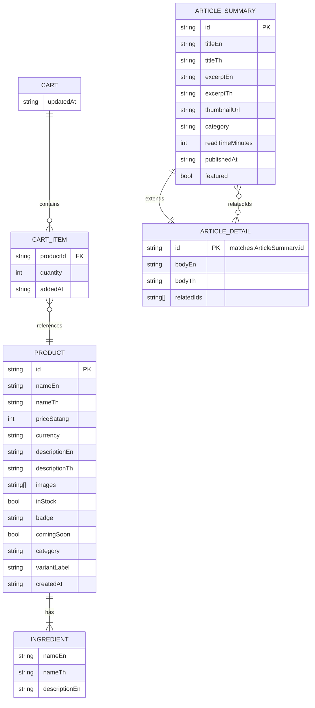
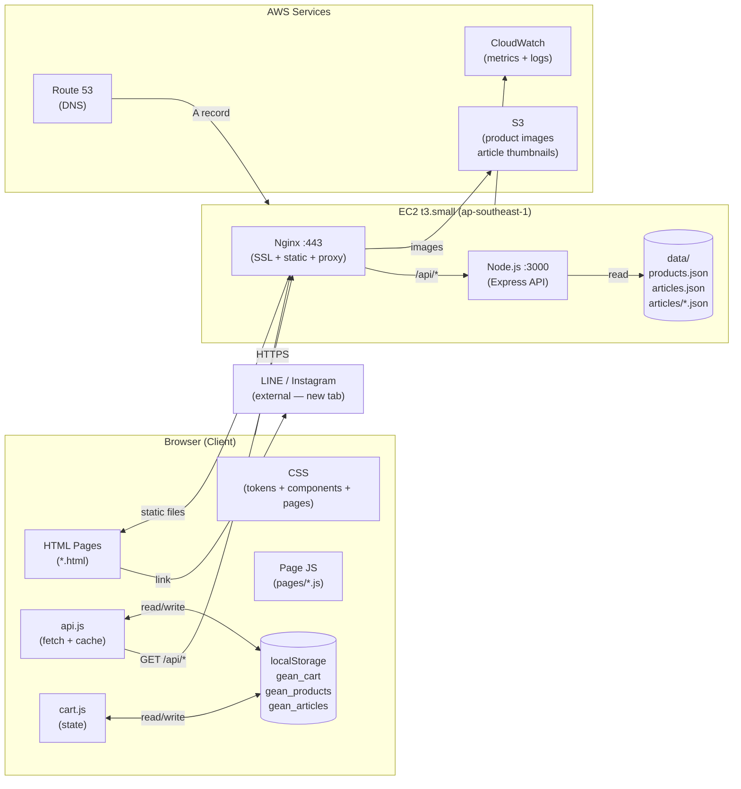

# GEAN — Technical Specification

**Version:** 1.1  
**Status:** Authoritative — this document is the single source of truth for all developers  
**References:** `docs/requirement.md`, `docs/data-schema.md`, `docs/ui-requirement.md`, `docs/architecture.md`

---

## Table of Contents

1. [Project Overview](#1-project-overview)
2. [Project Structure](#2-project-structure)
3. [API Specifications](#3-api-specifications)
4. [Business Logic & Sequence Diagrams](#4-business-logic--sequence-diagrams)
5. [Data Schema](#5-data-schema)
6. [Architecture Diagram](#6-architecture-diagram)
7. [Integration Contracts](#7-integration-contracts)
8. [Development Guidelines](#8-development-guidelines)

---

## 1. Project Overview

### 1.1 Purpose

GEAN is a Thai hand cream brand website targeting modern office professionals. It is a bilingual (Thai / English) multi-page web application with eight public screens. The site is informational and promotional — there is no online checkout. Customers order via LINE (`@gean.officially`).

### 1.2 Technology Stack

| Layer | Technology | Version | Rationale |
|---|---|---|---|
| HTML | Vanilla HTML5 | — | No build step required; matches prototype fidelity |
| CSS | Vanilla CSS3 | — | CSS custom properties for design tokens; no preprocessor |
| JavaScript | Vanilla ES2020 | — | No framework dependency; lightweight for a brochure site |
| Fonts | Montserrat (EN), Sarabun (TH) | — | Self-hosted `.ttf`; `unicode-range` splits for performance |
| Backend | Node.js + Express | 20 LTS / 4.x | Minimal API for content delivery |
| Process manager | PM2 | 5.x | Keeps Node.js alive; auto-restart on crash |
| Web server | Nginx | 1.24 | SSL termination, static file serving, reverse proxy |
| Data storage | JSON files on disk | — | No database needed at current product scale |
| Hosting | AWS EC2 `t3.small` | — | See `docs/architecture.md` |
| SSL | Let's Encrypt (Certbot) | — | Free; auto-renew via cron |

### 1.3 Development Environment Setup

**Prerequisites:**
- Node.js 20 LTS (`nvm install 20`)
- npm 10+
- Any modern browser (Chrome, Safari, Firefox)

**Local setup:**

```bash
# Clone the repository
git clone <repo-url> gean-web
cd gean-web

# Install API dependencies
cd api && npm install && cd ..

# Start the API server (port 3000)
cd api && node server.js

# Open the frontend — no build step required
# Open public/index.html directly in browser, or use a local static server:
npx serve public -p 8080
```

**Environment variables (API server):**

| Variable | Default | Description |
|---|---|---|
| `PORT` | `3000` | Port the Express server listens on |
| `DATA_DIR` | `../data` | Path to the directory containing JSON data files |
| `NODE_ENV` | `development` | `production` enables response compression and disables stack traces |

Create a `.env` file in `api/` (not committed to git):

```
PORT=3000
DATA_DIR=../data
NODE_ENV=development
```

---

## 2. Project Structure

### 2.1 Directory Tree

```
GEAN_WEB/
│
├── public/                         # Static frontend — served by Nginx
│   ├── index.html                  # Home page  (route: /)
│   ├── shop.html                   # Shop page  (route: /shop)
│   ├── product-detail.html         # Product Detail  (route: /product — id via ?id=)
│   ├── cart.html                   # Cart page  (route: /cart)
│   ├── our-story.html              # Our Story  (route: /our-story)
│   ├── article.html                # Article List  (route: /article)
│   ├── article-detail.html         # Article Detail  (route: /article/detail — id via ?id=)
│   ├── contact.html                # Contact Us  (route: /contact)
│   │
│   ├── css/
│   │   ├── tokens.css              # CSS custom properties (design tokens) — colors, spacing, radii
│   │   ├── base.css                # Reset, body defaults, typography, img, a
│   │   ├── navbar.css              # .navbar, .nav-links, .mobile-nav, .btn-nav-cta
│   │   ├── footer.css              # .footer, .footer-main, .footer-col, .footer-bottom
│   │   └── pages/
│   │       ├── home.css
│   │       ├── shop.css
│   │       ├── product-detail.css
│   │       ├── cart.css
│   │       ├── our-story.css
│   │       ├── article.css
│   │       ├── article-detail.css
│   │       └── contact.css
│   │
│   ├── js/
│   │   ├── api.js                  # API client + localStorage cache layer
│   │   ├── cart.js                 # Cart state: read/write/compute (no DOM)
│   │   ├── navbar.js               # Mobile menu toggle; active-link highlight
│   │   └── pages/
│   │       ├── home.js             # Hero scroll; product section render
│   │       ├── shop.js             # Product grid render; filter pills; sort
│   │       ├── product-detail.js   # Gallery tabs; info tabs; related products
│   │       ├── cart.js             # Cart page DOM: render items, qty controls
│   │       ├── our-story.js        # (Minimal — page is mostly static)
│   │       ├── article.js          # Article grid render; load more
│   │       ├── article-detail.js   # Language tab switch; sidebar render
│   │       └── contact.js          # (Minimal — page is mostly static)
│   │
│   └── assets/
│       ├── font/
│       │   ├── Montserrat/         # Montserrat variable font files
│       │   └── Sarabun/            # Sarabun variable font files
│       └── image/
│           ├── LOGO_GEAN.png
│           ├── QR_LINE_GEAN.PNG
│           └── products/           # Product images (served from S3 in production)
│
├── api/                            # Node.js Express backend
│   ├── server.js                   # App entry point; mounts routes; starts server
│   ├── routes/
│   │   ├── products.js             # GET /api/products, GET /api/products/:id
│   │   └── articles.js             # GET /api/articles, GET /api/articles/:id
│   ├── middleware/
│   │   └── cors.js                 # CORS headers for local development
│   ├── package.json
│   ├── package-lock.json
│   └── .env                        # Local env vars (not committed)
│
├── data/                           # JSON content files (source of truth for products/articles)
│   ├── products.json               # Array of Product objects
│   ├── articles.json               # Array of ArticleSummary objects
│   └── articles/
│       └── [slug].json             # Full ArticleDetail for each article
│
├── docs/                           # Project documentation
│   ├── requirement.md
│   ├── data-schema.md
│   ├── ui-requirement.md
│   ├── architecture.md
│   └── technical-spec.md           # ← this file
│
├── ui-prototypes/                  # HTML mockups — reference only, not deployed
│   ├── home.html
│   ├── shop.html
│   ├── product-detail.html
│   ├── cart.html
│   ├── our-story.html
│   ├── article.html
│   ├── article-detail.html
│   └── contact.html
│
├── asset/                          # Shared assets referenced by ui-prototypes
│   ├── font/
│   └── image/
│
├── .gitignore
└── README.md
```

### 2.2 Separation of Concerns

| Concern | Owner |
|---|---|
| Page structure and content | `public/*.html` |
| Design tokens | `public/css/tokens.css` |
| Shared UI components (navbar, footer) | `public/css/navbar.css`, `public/css/footer.css`, `public/js/navbar.js` |
| Page-specific layout | `public/css/pages/*.css` |
| Data fetching + localStorage cache | `public/js/api.js` |
| Cart state (read/write, no DOM) | `public/js/cart.js` |
| Page-specific interactivity | `public/js/pages/*.js` |
| Content data | `data/*.json` |
| API routing | `api/routes/*.js` |

---

## 3. API Specifications

All endpoints are served under the `/api` path prefix by Nginx proxying to the Node.js server on `localhost:3000`.

**Base URL (production):** `https://gean.co.th/api`  
**Base URL (local):** `http://localhost:3000/api`

**Common response headers:**

```
Content-Type: application/json; charset=utf-8
Cache-Control: public, max-age=3600
```

**Authentication:** None. All endpoints are public (read-only content).

---

### 3.1 `GET /api/products`

Returns the full product catalog.

#### Request

| Component | Detail |
|---|---|
| Method | `GET` |
| URL | `/api/products` |
| Query params | None |
| Request body | None |
| Auth | None |

#### Response — 200 OK

```json
{
  "items": [Product],
  "total": number
}
```

**`Product` object:**

| Field | Type | Constraints |
|---|---|---|
| `id` | `string` | Unique URL-safe slug. e.g. `"gean-hand-cream-30ml"` |
| `nameEn` | `string` | Non-empty |
| `nameTh` | `string` | Non-empty |
| `priceSatang` | `number` | Integer ≥ 0. e.g. `39000` for ฿390.00 |
| `currency` | `string` | Always `"THB"` |
| `descriptionEn` | `string` | Non-empty |
| `descriptionTh` | `string` | Non-empty |
| `images` | `string[]` | ≥ 1 URL. First element is the primary image. |
| `ingredients` | `Ingredient[]` | ≥ 1 item |
| `inStock` | `boolean` | |
| `badge` | `string \| null` | Display badge text e.g. `"New"`, `"Coming Soon"`, `null` |
| `comingSoon` | `boolean` | If `true`, product is not purchasable |
| `category` | `string` | e.g. `"Hand Care"`, `"Body Care"`, `"Lip Care"` |
| `variantLabel` | `string` | e.g. `"Office Essential · 30ml"` |
| `createdAt` | `string` | ISO 8601 date e.g. `"2026-01-15"` |

**`Ingredient` object:**

| Field | Type |
|---|---|
| `nameEn` | `string` |
| `nameTh` | `string` |
| `descriptionEn` | `string` |

#### Example Response

```json
{
  "items": [
    {
      "id": "gean-hand-cream-30ml",
      "nameEn": "GEAN Hand Cream",
      "nameTh": "ครีมบำรุงมือสูตรออฟฟิศเอสเซนเชียล",
      "priceSatang": 39000,
      "currency": "THB",
      "descriptionEn": "A luxurious hand cream crafted for the modern professional...",
      "descriptionTh": "ครีมมือสุดหรูที่ออกแบบมาสำหรับมืออาชีพยุคใหม่...",
      "images": ["/assets/image/products/hand-cream-30ml-front.jpg"],
      "ingredients": [
        {
          "nameEn": "95% Squalane Extract",
          "nameTh": "สควาเลน สกัด 95%",
          "descriptionEn": "Plant-derived squalane that mirrors skin's own lipids."
        }
      ],
      "inStock": true,
      "badge": "New",
      "comingSoon": false,
      "category": "Hand Care",
      "variantLabel": "Office Essential · 30ml",
      "createdAt": "2026-01-15"
    }
  ],
  "total": 3
}
```

#### Error Responses

| Status | Body | When |
|---|---|---|
| `500` | `{"error":"Internal server error","code":"PRODUCTS_READ_FAILED"}` | JSON file unreadable or malformed |

---

### 3.2 `GET /api/products/:id`

Returns a single product by slug ID.

#### Request

| Component | Detail |
|---|---|
| Method | `GET` |
| URL | `/api/products/:id` — e.g. `/api/products/gean-hand-cream-30ml` |
| Path param | `id` — product slug |
| Auth | None |

#### Response — 200 OK

Returns a single `Product` object (same schema as above, without the `items` wrapper).

#### Error Responses

| Status | Body | When |
|---|---|---|
| `404` | `{"error":"Product not found","code":"PRODUCT_NOT_FOUND"}` | No product with that id |
| `500` | `{"error":"Internal server error","code":"PRODUCTS_READ_FAILED"}` | Read error |

---

### 3.3 `GET /api/articles`

Returns all article summaries (no body content).

#### Request

| Component | Detail |
|---|---|
| Method | `GET` |
| URL | `/api/articles` |
| Query params | None |
| Auth | None |

#### Response — 200 OK

```json
{
  "items": [ArticleSummary],
  "total": number
}
```

**`ArticleSummary` object:**

| Field | Type | Constraints |
|---|---|---|
| `id` | `string` | Unique URL-safe slug e.g. `"why-squalane-gold-standard"` |
| `titleEn` | `string` | Non-empty |
| `titleTh` | `string` | Non-empty |
| `excerptEn` | `string` | ≤ 200 chars |
| `excerptTh` | `string` | ≤ 200 chars |
| `thumbnailUrl` | `string` | URL |
| `category` | `string` | `"Skincare"` \| `"Wellness"` \| `"Ingredients"` \| `"Lifestyle"` \| `"Science"` |
| `readTimeMinutes` | `number` | Positive integer |
| `publishedAt` | `string` | ISO 8601 date `"YYYY-MM-DD"` |
| `featured` | `boolean` | If `true`, displayed as the featured article at the top of the list |

#### Example Response

```json
{
  "items": [
    {
      "id": "why-squalane-gold-standard",
      "titleEn": "Why Squalane is the Gold Standard for Hand Hydration",
      "titleTh": "ทำไม Squalane ถึงเป็นมาตรฐานทองคำสำหรับการบำรุงมือ",
      "excerptEn": "Discover why 95% Squalane Extract has become the most sought-after ingredient...",
      "excerptTh": "ค้นพบว่าทำไม Squalane 95% จึงกลายเป็นส่วนผสมที่ต้องการมากที่สุด...",
      "thumbnailUrl": "/assets/image/articles/squalane-hero.jpg",
      "category": "Skincare",
      "readTimeMinutes": 5,
      "publishedAt": "2026-05-20",
      "featured": true
    }
  ],
  "total": 6
}
```

Articles are returned **newest first** (sorted by `publishedAt` descending) by the server.

#### Error Responses

| Status | Body | When |
|---|---|---|
| `500` | `{"error":"Internal server error","code":"ARTICLES_READ_FAILED"}` | Read error |

---

### 3.4 `GET /api/articles/:id`

Returns the full article detail including bilingual body content.

#### Request

| Component | Detail |
|---|---|
| Method | `GET` |
| URL | `/api/articles/:id` — e.g. `/api/articles/why-squalane-gold-standard` |
| Path param | `id` — article slug |
| Auth | None |

#### Response — 200 OK

**`ArticleDetail` object:**

| Field | Type | Constraints |
|---|---|---|
| `id` | `string` | Matches `ArticleSummary.id` |
| `titleEn` | `string` | Non-empty |
| `titleTh` | `string` | Non-empty |
| `bodyEn` | `string` | HTML string; allowed tags: `p`, `h2`, `blockquote`, `strong`, `em` |
| `bodyTh` | `string` | HTML string; same allowed tags |
| `thumbnailUrl` | `string` | URL |
| `category` | `string` | |
| `readTimeMinutes` | `number` | |
| `publishedAt` | `string` | ISO 8601 date |
| `relatedIds` | `string[]` | Up to 3 article slugs for the sidebar |

#### Error Responses

| Status | Body | When |
|---|---|---|
| `404` | `{"error":"Article not found","code":"ARTICLE_NOT_FOUND"}` | No article with that id |
| `500` | `{"error":"Internal server error","code":"ARTICLE_READ_FAILED"}` | Read error |

---

## 4. Business Logic & Sequence Diagrams

### 4.1 Product Data Load (cache-aware)

**Trigger:** Any page that renders product data (Shop, Product Detail, Home featured product, Cart).

**Business rules:**
1. On page load, call `api.getProducts()`.
2. Check `localStorage` key `gean_products`.
3. If key is absent or `cachedAt` is older than 1 hour → fetch `GET /api/products` → store result with current timestamp.
4. If cache is fresh → return cached data immediately (no network request).
5. If the fetch fails → use stale cache if available; otherwise render error state.



---

### 4.2 Article List Load (cache-aware)

**Trigger:** `article.html` page load.

**Layout:** One featured article (`.featured-article` block, shown when `article.featured === true`) is always displayed above the grid. The grid initially shows `GRID_ARTICLE_COUNT` cards; remaining cards are hidden and revealed by "Load More".



**Constants:**

| Constant | Value | Description |
|---|---|---|
| `GRID_ARTICLE_COUNT` | `2` | Non-featured cards shown in grid before Load More |
| Load More behavior | Show all remaining | One click reveals all remaining articles |

**Display count example:** 1 featured + 2 grid = "Showing 3 of 6 articles" (where total includes the featured article).

---

### 4.3 Article Detail Load (with language tabs)

**Trigger:** `article-detail.html` page load. The article ID is read from the URL query string: `?id=[slug]`.

**Language tab behavior:** Two toggle buttons ("EN" / "TH") switch the visible body content. The language state is local to the page and not persisted.



**Article Detail layout:** Two-column grid (article body + sidebar of related articles at `300px`). On tablet/mobile, sidebar collapses below the body.

---

### 4.4 Product Detail Page (tabs and gallery)

**Trigger:** `product-detail.html` page load. Product ID is read from `?id=[slug]`.

**Gallery:** Clicking a thumbnail updates the main view background and shows/hides the product tube visual. Four thumbnails: Product, Texture, Detail, Lifestyle.

**Info tabs:** Three tabs — Overview, Ingredients, The Ritual — toggle `.tab-pane` visibility. Active tab tracked by `aria-selected` attribute.

**CTA:** "สั่งซื้อผ่าน LINE" is an anchor (`<a href="/contact">`) — not an Add to Cart action. There is no add-to-cart flow on this page in the current implementation.

---

### 4.5 Add to Cart

**Note:** The current implementation routes purchase through LINE. "Buy Now" and "สั่งซื้อ" buttons are links to `/contact`. The Cart page (`cart.html`) exists but is decoupled from LINE ordering.

**If Cart functionality is fully activated (future):**



---

### 4.6 Cart Page — Quantity Change



---

### 4.7 Cart Total Calculation

The total is **never stored** — it is derived at render time.

```
subtotal = Σ (product.priceSatang × item.quantity) for each item
total    = subtotal   (shipping is free; no promo codes in v1)
displayPrice(satang) = "฿" + (satang / 100).toFixed(2)
```

---

### 4.8 Our Story Page

**Route:** `/our-story`

The page is primarily static. It reuses the same dark-navy hero background pattern (radial-gradient orbs + grid overlay) as all other interior pages. No dynamic data is loaded.

**Hero:** `min-height: 82vh` with a "Discover GEAN" CTA button that smooth-scrolls to `#story` below.

**Narrative layout:** Two-column grid — a vertical side label (rotated text, `writing-mode: vertical-lr`) on the left; the bilingual narrative on the right. The English text and Thai text are stacked within the same column, separated by a visual divider.

**JS:** `pages/our-story.js` only needs to implement the hero scroll behavior and mobile menu toggle. No API calls required.

---

## 5. Data Schema

### 5.1 Storage Overview

The project uses **two storage locations**:

| Storage | What | Who writes | Who reads |
|---|---|---|---|
| `localStorage` (browser) | Cart state, Product cache, Article cache | `cart.js`, `api.js` | `cart.js`, `api.js`, all page scripts |
| JSON files on disk | Product catalog, Article content | Human admin (via SSH/deploy) | Node.js API server |

There is no database.

---

### 5.2 localStorage Keys

| Key | TTL | Owner Module |
|---|---|---|
| `gean_cart` | None (persists until cleared) | `cart.js` |
| `gean_products` | 1 hour | `api.js` |
| `gean_articles` | 1 hour | `api.js` |
| `gean_article_{id}` | 1 hour | `api.js` |

---

### 5.3 TypeScript-style Type Definitions

These types are the canonical definitions used across both the API and the frontend JS (as JSDoc types).

```typescript
// ── Cart ─────────────────────────────────────────────────────────

interface Cart {
  items:     CartItem[];
  updatedAt: string;       // ISO 8601 datetime
}

interface CartItem {
  productId: string;       // References Product.id
  quantity:  number;       // Integer, 1–99
  addedAt:   string;       // ISO 8601 datetime
}

// ── Products ──────────────────────────────────────────────────────

interface Product {
  id:            string;
  nameEn:        string;
  nameTh:        string;
  priceSatang:   number;       // e.g. 39000 for ฿390.00
  currency:      'THB';
  descriptionEn: string;
  descriptionTh: string;
  images:        string[];     // URLs; first is primary
  ingredients:   Ingredient[];
  inStock:       boolean;
  badge:         string | null;
  comingSoon:    boolean;
  category:      string;
  variantLabel:  string;
  createdAt:     string;       // ISO 8601 date "YYYY-MM-DD"
}

interface Ingredient {
  nameEn:        string;
  nameTh:        string;
  descriptionEn: string;
}

interface ProductCatalogCache {
  items:    Product[];
  cachedAt: string | null;
}

// ── Articles ──────────────────────────────────────────────────────

interface ArticleSummary {
  id:               string;
  titleEn:          string;
  titleTh:          string;
  excerptEn:        string;    // ≤ 200 chars
  excerptTh:        string;    // ≤ 200 chars
  thumbnailUrl:     string;
  category:         string;
  readTimeMinutes:  number;
  publishedAt:      string;    // "YYYY-MM-DD"
  featured:         boolean;
}

interface ArticleDetail extends ArticleSummary {
  bodyEn:     string;    // HTML
  bodyTh:     string;    // HTML
  relatedIds: string[];  // up to 3 article slugs
  cachedAt?:  string;    // added by api.js when storing in localStorage
}

interface ArticleListCache {
  items:    ArticleSummary[];
  cachedAt: string | null;
}

// ── API Responses ─────────────────────────────────────────────────

interface ProductsResponse {
  items: Product[];
  total: number;
}

interface ArticlesResponse {
  items: ArticleSummary[];
  total: number;
}

interface ApiError {
  error: string;
  code:  string;
}
```

---

### 5.4 Entity-Relationship Diagram



---

### 5.5 Data Files on Disk

**`data/products.json`** — array of `Product` objects:

```json
[
  {
    "id": "gean-hand-cream-30ml",
    "nameEn": "GEAN Hand Cream",
    "nameTh": "ครีมบำรุงมือสูตรออฟฟิศเอสเซนเชียล",
    "priceSatang": 39000,
    "currency": "THB",
    "descriptionEn": "...",
    "descriptionTh": "...",
    "images": ["/assets/image/products/hand-cream-30ml.jpg"],
    "ingredients": [...],
    "inStock": true,
    "badge": "New",
    "comingSoon": false,
    "category": "Hand Care",
    "variantLabel": "Office Essential · 30ml",
    "createdAt": "2026-01-15"
  },
  {
    "id": "gean-body-serum",
    "nameEn": "GEAN Body Serum",
    "nameTh": "เจียน บอดี้ เซรั่ม",
    "priceSatang": 0,
    "currency": "THB",
    "descriptionEn": "Coming soon.",
    "descriptionTh": "เร็วๆ นี้",
    "images": [],
    "ingredients": [],
    "inStock": false,
    "badge": "Coming Soon",
    "comingSoon": true,
    "category": "Body Care",
    "variantLabel": "Nourishing Formula",
    "createdAt": "2026-06-01"
  }
]
```

**`data/articles.json`** — array of `ArticleSummary` objects (no body).

**`data/articles/why-squalane-gold-standard.json`** — a single `ArticleDetail` object.

---

### 5.6 Validation Rules

| Rule | Enforcement |
|---|---|
| `Cart.items` — only one entry per `productId` | `cart.js addItem()`: merge if exists |
| `CartItem.quantity` — min 1 | Enforced in `changeQty()`; never write 0; remove instead |
| `CartItem.quantity` — max 99 | `Math.min(qty, 99)` in `changeQty()` |
| `localStorage` parse failure | All reads wrapped in `try/catch`; return empty default on failure |
| Cache TTL — 1 hour | `Date.now() - Date.parse(cachedAt) > 3_600_000` |
| Price display | Always `(priceSatang / 100).toFixed(2)`, prefixed with `฿` |
| Article body HTML | Only `p`, `h2`, `blockquote`, `strong`, `em` tags rendered. Sanitise on write if a CMS is added. |

---

## 6. Architecture Diagram

### 6.1 System Architecture



### 6.2 Data Flow: Page Load

```
1. Browser requests /shop (Nginx serves shop.html + CSS + JS)
2. shop.js calls api.getProducts()
3. api.js checks localStorage gean_products
   a. Cache fresh → return immediately → render grid
   b. Cache stale/missing → GET /api/products → update cache → render grid
4. User clicks "สั่งซื้อ →" → navigates to /contact
```

---

## 7. Integration Contracts

### 7.1 `api.js` — Public Interface

All page scripts interact with the server exclusively through this module. Direct `fetch()` calls outside `api.js` are not permitted.

```javascript
/**
 * Returns all products (from cache or network).
 * @returns {Promise<Product[]>}
 */
async function getProducts() {}

/**
 * Returns a single product by id (from products cache).
 * @param {string} id
 * @returns {Promise<Product|null>}
 */
async function getProduct(id) {}

/**
 * Returns all article summaries (from cache or network).
 * @returns {Promise<ArticleSummary[]>}
 */
async function getArticles() {}

/**
 * Returns full article detail by id (from per-article cache or network).
 * @param {string} id
 * @returns {Promise<ArticleDetail|null>}
 */
async function getArticle(id) {}
```

**Error handling contract:** All functions return `null` (for single-item lookups) or `[]` (for list lookups) on error. They never throw. Page scripts check for falsy/empty returns and render error states accordingly.

---

### 7.2 `cart.js` — Public Interface

Cart state is owned exclusively by `cart.js`. No other module reads from or writes to `gean_cart` directly.

```javascript
/** @returns {Cart} */
function getCart() {}

/** Adds or increments an item. Emits 'cart:updated'. */
function addItem(productId, quantity = 1) {}

/** Changes item quantity by delta. Removes item if result <= 0. Emits 'cart:updated'. */
function changeQty(productId, delta) {}

/** Removes an item entirely. Emits 'cart:updated'. */
function removeItem(productId) {}

/** Returns total item count (sum of all quantities). @returns {number} */
function getTotalCount() {}

/**
 * Computes total price in satang. Requires product catalog.
 * @param {Product[]} products
 * @returns {number}
 */
function computeTotal(products) {}

/** Clears the cart entirely. Emits 'cart:updated'. */
function clearCart() {}
```

---

### 7.3 Custom DOM Events

Inter-module communication uses the browser's native `CustomEvent` API on `document`. No external event bus is introduced.

| Event name | `detail` payload | Emitted by | Consumed by |
|---|---|---|---|
| `cart:updated` | `{ cart: Cart }` | `cart.js` | `navbar.js` (badge update), `pages/cart.js` (re-render) |
| `lang:changed` | `{ lang: 'en' \| 'th' }` | `pages/article-detail.js` | Same module (shows/hides body divs) |

**Emit pattern:**

```javascript
document.dispatchEvent(new CustomEvent('cart:updated', { detail: { cart } }));
```

**Listen pattern:**

```javascript
document.addEventListener('cart:updated', ({ detail }) => {
  updateCartBadge(detail.cart);
});
```

---

### 7.4 Shared Constants

Defined in `public/js/api.js` and accessed as module-scoped constants via `window.GeanAPI`:

```javascript
const STORAGE_KEYS = {
  CART:     'gean_cart',
  PRODUCTS: 'gean_products',
  ARTICLES: 'gean_articles',
  ARTICLE:  (id) => `gean_article_${id}`,
};

const CACHE_TTL_MS        = 60 * 60 * 1000; // 1 hour
const API_BASE            = '/api';
const GRID_ARTICLE_COUNT  = 2;              // non-featured articles shown before Load More
const MAX_CART_QTY        = 99;
```

---

### 7.5 CSS Design Token Contract

All colours, spacing, and radius values must use CSS custom properties defined in `tokens.css`. Hard-coded hex values in component or page CSS are not permitted (except within `tokens.css` itself).

```css
/* tokens.css */
:root {
  /* Brand Colours */
  --navy:       #2A4A3E;
  --navy-dark:  #1C3530;
  --navy-900:   #111D1A;
  --tan:        #CFAB8D;
  --tan-light:  #E8D5C0;
  --tan-dark:   #B8956F;
  --sage:       #CCE1D9;
  --sage-dark:  #A8C9BC;
  --cream:      #F5FAF8;
  --white:      #FFFFFF;

  /* Text */
  --text:       #1A1A1A;
  --text-soft:  #3D3D3D;
  --muted:      #7A7A7A;
  --border:     #D8EAE4;

  /* Glassmorphism (home hero only) */
  --glass:      rgba(255, 255, 255, 0.06);
  --glass-b:    rgba(255, 255, 255, 0.10);

  /* Radii */
  --r-sm: 8px;
  --r:    16px;
  --r-lg: 24px;
  --r-xl: 40px;

  /* Shadows */
  --sh-sm: 0 4px 16px rgba(0,0,0,0.07);
  --sh-md: 0 8px 32px rgba(0,0,0,0.10);
  --sh-lg: 0 20px 60px rgba(0,0,0,0.14);
  --sh-xl: 0 40px 100px rgba(0,0,0,0.18);

  /* Layout */
  --sv:  clamp(72px, 7vw, 100px);   /* section vertical padding */
  --sh:  clamp(20px, 4vw, 56px);    /* section horizontal padding */
  --mw:  1240px;                     /* max content width */

  /* Easing */
  --ease-out:    cubic-bezier(0.22, 1, 0.36, 1);
  --ease-spring: cubic-bezier(0.34, 1.4, 0.64, 1);
}
```

> `--glass` and `--glass-b` are used only in the home page hero for the orb/overlay effects. They are defined in tokens.css for consistency but are not expected to appear in other page styles.

---

## 8. Development Guidelines

### 8.1 Coding Standards

#### JavaScript

- **ES2020** — use `const`/`let` (never `var`), optional chaining (`?.`), nullish coalescing (`??`), `async/await`.
- **No frameworks** — no React, Vue, or jQuery. Vanilla DOM APIs only.
- **Module pattern** — each JS file exposes its public interface by attaching to a global namespace object: `window.GeanCart`, `window.GeanAPI`. This avoids ES module bundler complexity.
- **No inline event handlers** in HTML (no `onclick="..."` attributes in the final implementation; the prototypes use them for brevity — remove in production).
- **Error boundaries** — every `async` page-init function is wrapped in `try/catch`; errors are caught and render an appropriate UI state rather than crashing the page.

#### CSS

- **Tokens first** — all values reference CSS custom properties from `tokens.css`.
- **Flat class naming** — class names use a single-level BEM-lite pattern (`.card-name`, `.card-footer`). No deep nesting in selectors.
- **No `!important`** — if specificity conflicts occur, restructure selectors.
- **Responsive breakpoints** — three breakpoints mirroring the prototypes: `1024px`, `768px`, `480px`. Media queries live at the bottom of each CSS file.

#### HTML

- Each page's `<head>` loads CSS in order: `tokens.css` → `base.css` → `navbar.css` → `footer.css` → `{page}.css`.
- Each page's `<body>` loads JS at the end: `api.js` → `cart.js` → `navbar.js` → `pages/{page}.js`.
- `alt` text on all `` elements.
- Semantic elements: `<nav>`, `<header>`, `<section>`, `<article>`, `<footer>`, `<main>`.

---

### 8.2 Naming Conventions

| Artifact | Convention | Example |
|---|---|---|
| HTML files | `kebab-case.html` | `product-detail.html` |
| CSS files | `kebab-case.css` | `product-detail.css` |
| JS files | `kebab-case.js` | `article-detail.js` |
| CSS class names | `kebab-case` | `.card-footer`, `.btn-primary` |
| JS functions | `camelCase` | `renderProductGrid()` |
| JS variables | `camelCase` | `const cartItems` |
| JS constants | `SCREAMING_SNAKE_CASE` | `const MAX_CART_QTY = 99` |
| JSON data file names | `kebab-case.json` | `why-squalane-gold-standard.json` |
| Product / article IDs (slugs) | `kebab-case` | `"gean-hand-cream-30ml"` |
| `localStorage` keys | `gean_snake_case` | `gean_products`, `gean_cart` |
| Custom DOM events | `noun:verb` | `cart:updated`, `lang:changed` |
| API route files | `plural-noun.js` | `products.js`, `articles.js` |

---

### 8.3 Git Workflow

**Branch strategy:** GitHub Flow (no `develop` branch needed at current team size).

```
main          ← production-ready code; deployed to EC2
  └── feature/shop-filter-pills
  └── fix/cart-qty-overflow
  └── content/add-article-ceramide
```

**Branch naming:**

| Prefix | Use for |
|---|---|
| `feature/` | New functionality |
| `fix/` | Bug fixes |
| `content/` | Data file changes (new articles, product updates) |
| `style/` | CSS-only changes |
| `docs/` | Documentation updates |
| `chore/` | Dependency updates, config, tooling |

**Commit message format** (Conventional Commits):

```
<type>(<scope>): <short description>

[optional body]
```

| Type | When |
|---|---|
| `feat` | New feature |
| `fix` | Bug fix |
| `style` | CSS/visual change, no logic change |
| `content` | Data file update |
| `docs` | Documentation only |
| `chore` | Tooling, config, dependencies |
| `refactor` | Code restructure, no behaviour change |

**Examples:**

```
feat(shop): add filter pills for product category
fix(cart): prevent quantity exceeding 99
content(articles): add article about ceramide complex
style(navbar): increase mobile menu z-index
docs(tech-spec): add sequence diagram for article load
```

**Pull Request rules:**
- PRs target `main`.
- Title follows commit message format.
- Self-review before requesting review.
- No direct pushes to `main`.

---

### 8.4 Responsive Breakpoints

| Breakpoint | Target | Key layout changes |
|---|---|---|
| `> 1024px` | Desktop | Full nav links visible; 3-column product grid; sticky product gallery |
| `≤ 1024px` | Tablet | 2-column product grid; footer collapses to 2-column |
| `≤ 768px` | Mobile landscape | Hamburger menu; 1-column product grid; product gallery unsticks |
| `≤ 480px` | Mobile portrait | 1-column everywhere; ingredient grid to 1-column |

---

### 8.5 Accessibility Checklist

- All interactive elements reachable by keyboard (`Tab`)
- `aria-label` on icon-only buttons (menu toggle, remove item `×`)
- `role="tablist"` and `aria-selected` on product detail tabs and article language tabs
- `alt` text on all images
- Colour contrast: all text at minimum WCAG AA (4.5:1) against its background
- Language attribute: `<html lang="th">` on Thai-primary pages; `lang="en"` elsewhere

---

### 8.6 API Server Conventions

- Route handlers are thin — they read a JSON file and return its content. No business logic in route files.
- All file reads use `fs.promises.readFile` (async; no blocking).
- The server responds with `Content-Type: application/json` for all `/api/*` routes.
- A 404 from the API always includes a `code` field (e.g. `PRODUCT_NOT_FOUND`) for programmatic error handling.
- CORS is enabled in `NODE_ENV=development` to allow the frontend on `localhost:8080` to call `localhost:3000`. In production, CORS is not needed (same origin via Nginx proxy).

---

### 8.7 Content Update Runbook

**To publish a new article:**

1. Create `data/articles/[slug].json` following the `ArticleDetail` schema.
2. Add a matching `ArticleSummary` entry to `data/articles.json` (set `featured: false` unless it should be the top article; only one entry should have `featured: true`).
3. Upload both files to the EC2 instance:
   ```bash
   scp data/articles/[slug].json ubuntu@<EC2-IP>:/var/www/gean/data/articles/
   scp data/articles.json ubuntu@<EC2-IP>:/var/www/gean/data/
   ```
4. No server restart required — Node.js reads files on each request.
5. Browser caches expire within 1 hour; users will see the new article automatically.

**To update a product (price, description, stock status):**

1. Edit `data/products.json`.
2. Upload: `scp data/products.json ubuntu@<EC2-IP>:/var/www/gean/data/`
3. No restart required.
