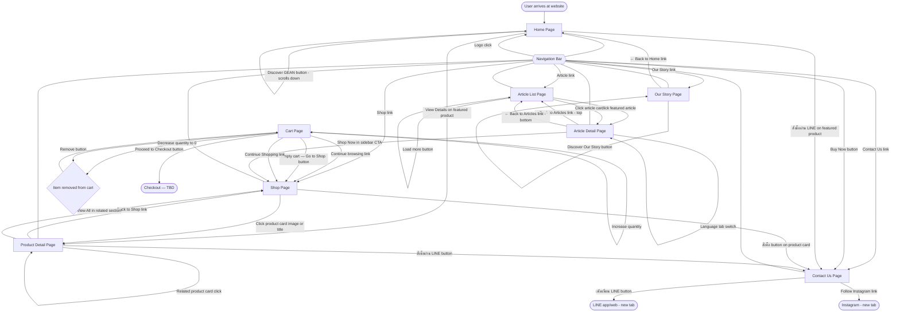

# GEAN — UX/UI Requirements Document

**Version:** 2.0  
**Audience:** UI/UX Design Team  
**Scope:** User flows, screen interactions, and displayed data. Does not include visual design, layout, colors, or typography.

---

## Table of Contents

1. [Screens Overview](#1-screens-overview)
2. [Complete User Flow Diagram](#2-complete-user-flow-diagram)
3. [Global Components](#3-global-components)
   - 3.1 [Navigation Bar](#31-navigation-bar)
   - 3.2 [Footer](#32-footer)
4. [Screen: Home](#4-screen-home)
5. [Screen: Shop](#5-screen-shop)
6. [Screen: Product Detail](#6-screen-product-detail)
7. [Screen: Cart](#7-screen-cart)
8. [Screen: Our Story](#8-screen-our-story)
9. [Screen: Article List](#9-screen-article-list)
10. [Screen: Article Detail](#10-screen-article-detail)
11. [Screen: Contact Us](#11-screen-contact-us)

---

## 1. Screens Overview

| Screen | Route | Entry Points |
|---|---|---|
| Home | `/` | Direct URL, logo click, browser back from any page |
| Shop | `/shop` | "Shop" nav link |
| Product Detail | `/product/[id]` | Product card click (Shop), "View Details" (Home featured product) |
| Cart | `/cart` | Dedicated page — linked from cart note on any page, or "My Cart" navigation |
| Our Story | `/our-story` | "Our Story" nav link |
| Article List | `/article` | "Article" nav link |
| Article Detail | `/article/[id]` | Article card click on Article List page |
| Contact Us | `/contact` | "Contact Us" nav link, "Buy Now" nav button (most pages) |

> **Ordering model:** GEAN does not have an online checkout flow. Customers order via LINE. The "Buy Now" / "สั่งซื้อ" CTAs on all screens direct users to the Contact page where they can connect via LINE.

---

## 2. Complete User Flow Diagram

---

## 3. Global Components

### 3.1 Navigation Bar

Present on every screen. Sticky — remains visible regardless of scroll position.

#### User Interactions

| Element | Type | Action |
|---|---|---|
| GEAN Logo | Link | Navigates to Home (`/`) |
| Shop | Link | Navigates to Shop (`/shop`) |
| Our Story | Link | Navigates to Our Story (`/our-story`) |
| Article | Link | Navigates to Article List (`/article`) |
| Contact Us | Link | Navigates to Contact Us (`/contact`) |
| Buy Now | Button | Navigates to Contact Us (`/contact`) to order via LINE |
| Menu Toggle (mobile) | Button | Opens/closes the mobile navigation slide-in panel |

#### Output / Displayed Data

| Data | Format | Dynamic? |
|---|---|---|
| Active page indicator | Visual state on the matching nav link | Yes — changes with current route |

#### Conditional Display Logic

- **Mobile menu:** The full link list and Buy Now button are hidden by default on small screens; revealed when the menu toggle is tapped. A semi-transparent backdrop appears behind the panel; tapping it closes the menu.
- **Active state:** The link matching the current page URL is visually distinguished from the others (underline animation).

---

### 3.2 Footer

Present at the bottom of every screen, below all page content.

#### User Interactions

| Element | Type | Action |
|---|---|---|
| GEAN Logo | Display | No interaction (brand identity only) |
| Shop | Link | Navigates to Shop |
| Our Story | Link | Navigates to Our Story |
| Article | Link | Navigates to Article List |
| Contact Us | Link | Navigates to Contact Us |
| LINE button | Link | Opens LINE in a new browser tab |
| IG button | Link | Opens Instagram in a new browser tab |
| LINE (Contact column) | Link | Opens LINE in a new browser tab |
| Instagram (Contact column) | Link | Opens Instagram in a new browser tab |

#### Output / Displayed Data

| Data | Format | Dynamic? |
|---|---|---|
| Copyright notice | Text: `© 2026 GEAN. All rights reserved.` | Static |
| Brand tagline | `Beyond moisture. A sanctuary for your hands. Premium hand care for the modern professional.` | Static |
| Navigate links | Shop, Our Story, Article, Contact Us | Static |
| Contact links | LINE `@gean.officially`, Instagram `@gean.officially` | Static |
| Social buttons | LINE, IG | Static |

---

## 4. Screen: Home

**Route:** `/`

### Purpose

First impression screen. Communicates the brand identity, introduces the product, explains its benefits, and guides visitors toward discovery and purchase via LINE.

### Sections and User Interactions

#### 4.1 Hero Section

| Element | Type | Action |
|---|---|---|
| "Discover GEAN" button | Button | Smoothly scrolls the page down to the Featured Product section (`#product`) |

#### Output / Displayed Data

| Data | Format | Dynamic? |
|---|---|---|
| Eyebrow label | Text: `GEAN Care` | Static |
| Headline | Text: `Work Smarter, Feel Better.` | Static |
| Subtext | Three tags: `Zero Greasiness · Focused Scent · Office Essential` | Static |
| Scroll indicator | Animated line + `Scroll` text at bottom of hero | Static |

---

#### 4.2 Stats Strip

No interactive elements. Purely informational.

#### Output / Displayed Data

| Data | Format | Dynamic? |
|---|---|---|
| Stat 1 | `0%` + label `Greasiness` | Static |
| Stat 2 | `30ml` + label `Precision Dose` | Static |
| Stat 3 | `6` + label `Active Ingredients` | Static |
| Stat 4 | `฿390` + label `One Time. All Day.` | Static |

---

#### 4.3 Featured Product Section

| Element | Type | Action |
|---|---|---|
| "สั่งซื้อผ่าน LINE →" button | Link | Navigates to Contact page (`/contact`) to order via LINE |
| "View Details" button | Link | Navigates to the Product Detail page |

#### Output / Displayed Data

| Data | Format | Dynamic? |
|---|---|---|
| Section eyebrow | Text: `Our Product` | Static |
| Section title | Text: `The Office Essential Hand Cream` | Static |
| Product visual | Placeholder/image area with GEAN logo mark, volume label `30 ml`, and badge `Hand Cream` | Static (will be dynamic from catalog) |
| Product tag | Text: `Office Essential` | Static |
| Product name (EN) | Text: `GEAN Hand Cream` | Dynamic (from product catalog) |
| Product name (TH) | Text: `ครีมบำรุงมือสูตรออฟฟิศเอสเซนเชียล` | Dynamic |
| Product description | Mixed EN/TH paragraph | Dynamic |
| Price | `฿390 / 30 ml` | Dynamic |

---

#### 4.4 Marquee Strip

No interactive elements. Continuously scrolling marquee.

#### Output / Displayed Data

| Data | Format | Dynamic? |
|---|---|---|
| Marquee items | Repeating text list: `Zero Greasiness · Instant Absorption · Office Essential · Focus-Forward Scent · Professional Formula · 95% Squalane · Ceramide Complex · Damask Rose` | Static |

---

#### 4.5 Why GEAN? Section

No interactive elements.

#### Output / Displayed Data

| Data | Format | Dynamic? |
|---|---|---|
| Section eyebrow | Text: `Why Hand Cream?` | Static |
| Section title | Text: `Because your hands deserve professional care` | Static |
| Card 1 | Number `01` + title `Mouse Friendly` + Thai description | Static |
| Card 2 | Number `02` + title `Private Scent` + Thai description | Static |
| Card 3 | Number `03` + title `Professional` + Thai description | Static |

---

#### 4.6 Three Pillars Section

No interactive elements. Alternating numbered rows.

#### Output / Displayed Data

| Data | Format | Dynamic? |
|---|---|---|
| Section eyebrow | Text: `The Benefits` | Static |
| Section title | Text: `Three Pillars of GEAN` | Static |
| Section note | Thai description paragraph | Static |
| Pillar 01 | Number `01` + title `Freshly Clean` + Thai description | Static |
| Pillar 02 | Number `02` + title `Repairing Comfort` + Thai description | Static |
| Pillar 03 | Number `03` + title `Deep Nourishment` + Thai description | Static |

---

#### 4.7 Brand Tagline Section

No interactive elements.

#### Output / Displayed Data

| Data | Format | Dynamic? |
|---|---|---|
| English quote | `"Beyond moisture. A sanctuary for your hands."` | Static |
| Thai translation | `มากกว่าความชุ่มชื้น แต่นี่คือพื้นที่พักพิงสำหรับมือของคุณ` | Static |

---

#### 4.8 Core Ingredients Section

No interactive elements.

#### Output / Displayed Data

| Data | Format | Dynamic? |
|---|---|---|
| Section eyebrow | Text: `Formula` | Static |
| Section title | Text: `The Core Elements` | Static |
| Ingredient 1 | Initials `SQ` + `95% Squalane Extract` + role `Deep hydration carrier` | Static |
| Ingredient 2 | Initials `CE` + `Ceramide Complex` + role `Barrier repair` | Static |
| Ingredient 3 | Initials `DP` + `D-Panthenol (DAPF)` + role `Skin recovery` | Static |
| Ingredient 4 | Initials `GT` + `Premium Green Tea Extract` + role `Antioxidant protection` | Static |
| Ingredient 5 | Initials `WT` + `White Tea Essence` + role `Calming & brightening` | Static |
| Ingredient 6 | Initials `DR` + `Damask Rose` + role `Signature scent & tone` | Static |

### Navigation Into This Screen

- Logo click from any page
- Direct URL (`/`)
- Browser back button from other pages

### Navigation Out of This Screen

- Nav bar links (to any page)
- "Discover GEAN" button → scrolls within Home to Featured Product
- "View Details" on featured product → Product Detail
- "สั่งซื้อผ่าน LINE →" → Contact page

---

## 5. Screen: Shop

**Route:** `/shop`

### Purpose

Allows visitors to browse all available GEAN products and initiate purchase via LINE.

### Page Header

#### Output / Displayed Data

| Data | Format | Dynamic? |
|---|---|---|
| Eyebrow | Text: `GEAN Care` | Static |
| Page title | `Shop Collection` | Static |
| Sub-label | `Premium hand care for the modern professional` | Static |
| Product count | Text: `N Product Available` | Dynamic (from product count) |

### User Interactions

| Element | Type | Action |
|---|---|---|
| Filter pill | Button | Filters displayed products by category; active pill is highlighted |
| Sort select | Dropdown | Sorts displayed products (Featured, Price: Low to High, Price: High to Low, Newest) |
| Product card image or title | Link | Navigates to Product Detail page for that product |
| "สั่งซื้อ →" button (per product) | Link | Navigates to Contact page to order via LINE |

### Output / Displayed Data

| Data | Format | Dynamic? |
|---|---|---|
| Filter pills | `All`, `Hand Care`, `New Arrivals` | Static labels; active state is dynamic |
| Sort dropdown | Options: Featured, Price: Low to High, Price: High to Low, Newest | Static |
| Product grid | 3-column grid of product cards (1 active + "Coming Soon" placeholders) | Dynamic (from product catalog) |
| Per product card: image area | Gradient placeholder or product image | Dynamic |
| Per product card: badge | Text badge e.g. `New` | Dynamic |
| Per product card: category eyebrow | Text e.g. `Hand Care` | Dynamic |
| Per product card: name | Text | Dynamic |
| Per product card: variant | Text e.g. `Office Essential · 30ml` | Dynamic |
| Per product card: price | Formatted currency e.g. `฿390` | Dynamic |
| Per product card: "สั่งซื้อ →" button | Button/link | Dynamic — hidden if product is Coming Soon |
| Coming Soon cards | Greyed-out cards with `Coming Soon` badge and no buy button | Conditional — shown when product not yet available |

#### Conditional Display Logic

- **Coming Soon products:** Cards are rendered at reduced opacity, not clickable, no "สั่งซื้อ" button shown.
- **Active filter pill:** Only one filter pill is active at a time. Clicking a new one deactivates the previous.

### Input Fields

Sort dropdown is the only input. Filter pills are button interactions.

### Navigation Into This Screen

- "Shop" nav link from any page
- "Go to Shop" button from empty Cart
- "View All" link from Product Detail related section
- "Continue browsing" link from Cart page

### Navigation Out of This Screen

- Product card click → Product Detail
- "สั่งซื้อ →" button → Contact page
- Nav bar → any page

---

## 6. Screen: Product Detail

**Route:** `/product/[id]`

### Purpose

Shows complete information about a single product. Customers are directed to LINE to place an order.

### User Interactions

| Element | Type | Action |
|---|---|---|
| Gallery thumbnail (4 options: Product, Texture, Detail, Lifestyle) | Button | Switches the displayed main product image/background |
| Tab: "Overview" | Button | Displays the product description (EN + TH) |
| Tab: "Ingredients" | Button | Displays the full ingredient list with descriptions |
| Tab: "The Ritual" | Button | Displays the 4-step usage ritual |
| "สั่งซื้อผ่าน LINE" button | Link | Navigates to Contact page to order via LINE |
| "Add to Wishlist" button | Button | Ghost/secondary action (no current functional flow defined) |
| "Back to Shop" link | Link | Navigates back to the Shop page |
| Related product card | Link | Navigates to that product's detail page |
| "View All →" link | Link | Navigates to the Shop page |

### Output / Displayed Data

#### Product Hero (sticky gallery + info panel)

| Data | Format | Dynamic? |
|---|---|---|
| Gallery: main image area | Large visual with gradient background | Dynamic |
| Gallery: thumbnails | 4 thumbnails (Product, Texture, Detail, Lifestyle) with labels | Dynamic (will be real images) |
| Back to Shop link | Text: `← Back to Shop` | Static |
| Eyebrow | Text: `Hand Care · Office Essential` | Dynamic |
| Product name (EN) | Text: `GEAN Hand Cream` | Dynamic |
| Product name (TH) | Text: `ครีมมือ — สูตรออฟฟิศเอสเซนเชียล · 30 ml` | Dynamic |
| Price | Formatted currency: `฿390 / 30 ml` | Dynamic |
| Stock status | Text: `In stock — ships within 1–3 days` (green indicator dot) | Dynamic |

#### Tabs Content

**Overview tab:**

| Data | Format | Dynamic? |
|---|---|---|
| Description (EN) | 2–3 paragraphs | Dynamic |
| Description (TH) | 1–2 paragraphs | Dynamic |

**Ingredients tab:**

| Data | Format | Dynamic? |
|---|---|---|
| Ingredient list | List of items each with: name (EN uppercase), description (EN) | Dynamic |
| Ingredients: 95% Squalane Extract, Ceramide Complex, D-Panthenol (DAPF), Premium Green Tea, White Tea Essence, Damask Rose | As listed | Dynamic |

**The Ritual tab:**

| Data | Format | Dynamic? |
|---|---|---|
| Step 01 | Numbered text step | Static |
| Step 02 | Numbered text step | Static |
| Step 03 | Numbered text step | Static |
| Step 04 | Numbered text step | Static |

#### Trust Strip (below CTA)

| Data | Format | Dynamic? |
|---|---|---|
| Trust item 1 | Label `Zero Greasy` + sub `Absorbs instantly` | Static |
| Trust item 2 | Label `Derm Tested` + sub `Clinically verified` | Static |
| Trust item 3 | Label `1–3 Day Ship` + sub `Nationwide delivery` | Static |

#### Crafted With Section

| Data | Format | Dynamic? |
|---|---|---|
| Section eyebrow | Text: `Formulation` | Static |
| Section title | Text: `Crafted with intention` | Static |
| 6 ingredient cards | Each with number, name, description paragraph | Dynamic |

#### The Ritual Section

| Data | Format | Dynamic? |
|---|---|---|
| Section eyebrow | Text: `Usage` | Static |
| Section title | Text: `The ritual` | Static |
| Step 01 | `Apply` + description | Static |
| Step 02 | `Massage` + description | Static |
| Step 03 | `Continue` + description | Static |

#### Related Products Section

| Data | Format | Dynamic? |
|---|---|---|
| Section eyebrow | Text: `Collection` | Static |
| Section title | Text: `You may also like` | Static |
| "View All →" link | Text link | Static |
| Related product cards | 3-column grid; active products are clickable, Coming Soon products are greyed/non-clickable | Dynamic |

#### Conditional Display Logic

- **Stock status:** Shown in green (`In stock`) or red/disabled state when out of stock. Out-of-stock products disable the "สั่งซื้อผ่าน LINE" button.
- **Related Coming Soon:** Coming Soon product cards are rendered at reduced opacity with no click behaviour.

### Navigation Into This Screen

- Product card click on Shop page
- "View Details" button on Home featured product
- Related product card click on another Product Detail page

### Navigation Out of This Screen

- "Back to Shop" link → Shop
- "สั่งซื้อผ่าน LINE" button → Contact page
- Related card click → Product Detail (different product)
- "View All" → Shop
- Nav bar → any page

---

## 7. Screen: Cart

**Presentation:** Dedicated full page at `/cart` — not an overlay or drawer.

### Purpose

Lets the user review what they have selected, adjust quantities, remove items, see the total cost, and initiate purchase.

### Page Header

| Data | Format | Dynamic? |
|---|---|---|
| Eyebrow | Text: `GEAN Care` | Static |
| Page title | Text: `My Cart` | Static |

### User Interactions

| Element | Type | Action |
|---|---|---|
| "Continue browsing →" link (top note) | Link | Navigates to Shop page |
| Increase quantity button (+) per item | Button | Increments that item's quantity by 1 (max 99) |
| Decrease quantity button (−) per item | Button | Decrements that item's quantity by 1; removes item if quantity reaches 0 |
| Remove button (×) per item | Button | Immediately removes that item from the cart |
| "Proceed to Checkout" button | Button | Initiates checkout flow (TBD) |
| "← Continue Shopping" link (below checkout button) | Link | Navigates to Shop page |
| "Go to Shop" button | Button/Link | Navigates to Shop (shown only in empty cart state) |

### Output / Displayed Data

| Data | Format | Dynamic? |
|---|---|---|
| Top note | `Want to keep shopping? Continue browsing →` | Static |
| Cart items table header | Columns: Product, Unit Price, Quantity, (remove) | Static |
| Per item: product thumbnail | Image/gradient placeholder | Dynamic |
| Per item: product name | Text | Dynamic |
| Per item: variant | Text e.g. `Original · 30ml` | Dynamic |
| Per item: unit price | Formatted currency e.g. `฿390.00` | Dynamic |
| Per item: quantity | Integer with +/− controls | Dynamic |
| Order Summary: Subtotal | Formatted currency + item count | Dynamic — recalculates on quantity change |
| Order Summary: Shipping | Text: `Free` | Static |
| Order Summary: Total | Formatted currency | Dynamic |
| Trust row | 3 items: `Secure / Safe checkout`, `Free Ship / All orders`, `1–3 Days / Delivery` | Static |
| Empty state icon | Circular icon `○` | Conditional |
| Empty state title | Text: `Your cart is empty` | Conditional |
| Empty state description | Text: `Looks like you haven't added anything yet.` | Conditional |
| "Go to Shop" button | Button | Conditional — shown only in empty state |

#### Conditional Display Logic

- **Empty state:** When `cart.items` is empty, hide the items table and summary, show empty state with Go to Shop.
- **Checkout button (empty state):** Rendered but disabled (`opacity 0.35`, `cursor: not-allowed`).
- **Quantity ceiling:** When an item's quantity equals 99, the increase (+) button is disabled.
- **Quantity decrease to 0:** Item is removed rather than showing 0.

### Navigation Into This Screen

- Cart page link from anywhere (note: there is no global cart icon in the current nav; cart page is accessed directly)

### Navigation Out of This Screen

- "Continue browsing →" link → Shop
- "← Continue Shopping" link → Shop
- "Go to Shop" button (empty state) → Shop
- "Proceed to Checkout" → Checkout (TBD)
- Nav bar → any page

---

## 8. Screen: Our Story

**Route:** `/our-story`

### Purpose

Presents the GEAN brand narrative in both English and Thai, plus brand values, to build trust and emotional connection with the visitor.

### User Interactions

| Element | Type | Action |
|---|---|---|
| "Discover Our Story" button (in hero) | Button | Smoothly scrolls page down to the story content section (`#story`) |
| "← Back to Home" link (within story section) | Link | Navigates to Home page (`/`) |

### Output / Displayed Data

#### Hero

| Data | Format | Dynamic? |
|---|---|---|
| Eyebrow | `GEAN Brand` | Static |
| Headline | `Work Smarter, Feel Better.` | Static |
| Subtext | `Zero Greasiness · Scent for Focused Minds · The Office Essential` | Static |
| "Discover Our Story" button | Button | Static |

#### Story Section

| Data | Format | Dynamic? |
|---|---|---|
| Side label | `Our Story` (vertical text) | Static |
| Section eyebrow | `The GEAN Story` | Static |
| Section title | `Born from a simple belief` | Static |
| Article 01 — English | EN language tag + 4 paragraphs of brand narrative in English | Static |
| Article 02 — Thai | TH language tag + 3 paragraphs of brand narrative in Thai | Static |
| "← Back to Home" link | Text link at bottom of story articles | Static |

#### Brand Statement Section

| Data | Format | Dynamic? |
|---|---|---|
| Opening quote mark | `"` decorative | Static |
| Quote text (Thai) | `เราไม่ได้สร้างแค่ครีมมือ เราสร้างกิจกรรมเล็กๆ ที่ทำให้วันทำงานของคุณดีขึ้น` | Static |
| Attribution | `GEAN — Beyond Moisture` | Static |

#### Core Values Section

| Data | Format | Dynamic? |
|---|---|---|
| Section eyebrow | `What we stand for` | Static |
| Section title | `Our Core Values` | Static |
| Value 01 | Icon + `Authenticity` + description | Static |
| Value 02 | Icon + `Excellence` + description | Static |
| Value 03 | Icon + `Professional` + description | Static |
| Value 04 | Icon + `Wellbeing` + description | Static |

### Input Fields

None.

### Error States

None — content is fully static.

### Navigation Into This Screen

- "Our Story" nav link from any page
- Direct URL (`/our-story`)

### Navigation Out of This Screen

- "← Back to Home" link → Home
- Nav bar links → any page

---

## 9. Screen: Article List

**Route:** `/article`

### Purpose

Provides a browsable collection of GEAN articles on skincare and wellness, with a featured article and a paginated grid.

### Page Header

| Data | Format | Dynamic? |
|---|---|---|
| Eyebrow | Text: `GEAN Knowledge` | Static |
| Page title | Text: `Knowledge Hub` | Static |
| Sub-label | Text: `Skincare science, wellness rituals & the science of GEAN` | Static |

### User Interactions

| Element | Type | Action |
|---|---|---|
| Featured article "Read Full Article →" link | Link | Navigates to Article Detail page for the featured article |
| Article card (image, title, or "Read More →") | Link | Navigates to Article Detail page for that article |
| "Load More Articles" button | Button | Reveals additional hidden article cards in the grid and updates the article count label |

### Output / Displayed Data

#### Featured Article (top, before the grid)

| Data | Format | Dynamic? |
|---|---|---|
| Featured image | 2-column card with large image on left | Dynamic |
| Category badge | Text e.g. `Skincare` | Dynamic |
| Publish date + "Featured" label | Text e.g. `20 May 2026 · Featured` | Dynamic |
| Article title | Text | Dynamic |
| Excerpt | Short paragraph | Dynamic |
| "Read Full Article →" link | Text link | Dynamic |
| Read time | Text e.g. `5 min read` | Dynamic |

#### Grid Header

| Data | Format | Dynamic? |
|---|---|---|
| Section eyebrow | Text: `All Articles` | Static |
| Article count | Text: `N articles` | Dynamic (total count) |

#### Article Grid

| Data | Format | Dynamic? |
|---|---|---|
| Article cards | 3-column grid | Dynamic (from article list) |
| Per card: image area | Gradient or article image with category badge | Dynamic |
| Per card: category badge | Text e.g. `Wellness`, `Ingredients`, `Science`, `Lifestyle` | Dynamic |
| Per card: publish date | Formatted date e.g. `15 May 2026` | Dynamic |
| Per card: article title | Text | Dynamic |
| Per card: excerpt | Short paragraph (3-line clamp) | Dynamic |
| Per card: "Read More →" link | Text link | Dynamic |
| Per card: read time | Text e.g. `4 min` | Dynamic |

#### Load More

| Data | Format | Dynamic? |
|---|---|---|
| "Load More Articles" button | Button | Conditional — hidden when all articles are shown |
| Article count label | Text: `Showing N of M articles` | Dynamic — updates after load more |
| Empty state | Text: `No articles yet. Check back soon.` | Conditional — shown only when article list has 0 items |

#### Conditional Display Logic

- **"Load More":** Shown only when total articles > number currently displayed. Hidden after all articles are shown. Initially shows 3 of N articles; clicking loads the rest.
- **Empty state:** Shown only when the article list has 0 items (no featured article, no grid).

### Input Fields

None.

### Error State

- If article data fails to load: show `Unable to load articles. Please try again later.` with a `Retry` button.

### Navigation Into This Screen

- "Article" nav link from any page
- Direct URL (`/article`)

### Navigation Out of This Screen

- Featured article click → Article Detail
- Article card click → Article Detail
- Nav bar → any page

---

## 10. Screen: Article Detail

**Route:** `/article/[id]`

### Purpose

Displays the full content of a single article with bilingual support (EN/TH toggle), a sticky sidebar with related articles, and a product CTA.

### User Interactions

| Element | Type | Action |
|---|---|---|
| "← Back to Articles" link (top, in hero) | Link | Navigates back to the Article List page |
| "English" language tab | Button | Displays the English article body; hides Thai body |
| "ภาษาไทย" language tab | Button | Displays the Thai article body; hides English body |
| "← Back to Articles" button (bottom, below article body) | Link/Button | Navigates back to the Article List page |
| Related article link (in sidebar) | Link | Navigates to that article's detail page |
| "Shop Now" button (in sidebar CTA card) | Link | Navigates to Shop page |

### Output / Displayed Data

#### Article Hero

| Data | Format | Dynamic? |
|---|---|---|
| "← Back to Articles" link | Text link | Static |
| Category badge | Text e.g. `Skincare` | Dynamic |
| Article title | Text (large heading) | Dynamic |
| Publish date | Formatted date e.g. `20 May 2026` (highlighted in tan) | Dynamic |
| Read time | Text e.g. `5 min read` | Dynamic |
| Topic tag | Text e.g. `Skincare Science` | Dynamic |

#### Language Tabs

| Data | Format | Dynamic? |
|---|---|---|
| "English" tab | Tab button — active state: navy background | Dynamic (switches body content) |
| "ภาษาไทย" tab | Tab button — active state: tan background | Dynamic |

#### Article Body

| Data | Format | Dynamic? |
|---|---|---|
| English body | Long-form text with h2 sub-headings, paragraphs, blockquotes, and inline image placeholders | Dynamic — shown when English tab is active |
| Thai body | Long-form text with h2 sub-headings, paragraphs, blockquotes | Dynamic — shown when Thai tab is active |
| "← Back to Articles" bottom button | Styled button at end of body | Static |

#### Sidebar (sticky)

| Data | Format | Dynamic? |
|---|---|---|
| Sidebar card title | `Related Articles` | Static |
| Related article items | Thumbnail + title + date — 3 items | Dynamic |
| CTA card title | `Try GEAN Today` | Static |
| CTA card description | Short text about the product | Static |
| "Shop Now" button | Button linking to Shop | Static |

#### Conditional Display Logic

- **Language tabs:** Only one language body is visible at a time. Default is English.
- **Thai body:** If the article has no Thai body text, the Thai tab is hidden.
- **Sidebar:** On mobile (≤900px), the sidebar collapses below the article body (not sticky).

### Input Fields

None.

### Error State

- If article ID is not found: show `Article not found.` with a button `← Back to Articles`.

### Navigation Into This Screen

- Featured article click on Article List page
- Article card click on Article List page
- Related article click within another Article Detail
- Direct URL (`/article/[id]`)

### Navigation Out of This Screen

- "← Back to Articles" (top or bottom) → Article List
- Related article click → Article Detail (different article)
- "Shop Now" sidebar CTA → Shop
- Nav bar → any page

---

## 11. Screen: Contact Us

**Route:** `/contact`

### Purpose

The primary conversion screen. Provides all available channels for customers to order and reach the GEAN team (LINE and Instagram), a scannable LINE QR code, and a quick Thai-language FAQ.

### Page Header

| Data | Format | Dynamic? |
|---|---|---|
| Tag | Text: `Contact` | Static |
| Page title | Text: `Let's Connect` | Static |
| Description | Thai text: `ติดต่อเราผ่าน LINE หรือ Instagram — ทีมงานพร้อมตอบทุกคำถามทุกวัน ไม่มีวันหยุด` | Static |

### User Interactions

| Element | Type | Action |
|---|---|---|
| LINE contact row | Clickable row | The whole row links to LINE (same as button below) |
| "เพิ่มเพื่อน LINE" button | Link | Opens LINE (`lin.ee/9KbETXv`) in a new browser tab |
| QR code image | Display only | No interaction — scan to add on LINE |
| Instagram contact row | Clickable row | Opens Instagram (`instagram.com/gean.officially`) in a new browser tab |
| "Follow" link (IG row) | Link | Opens Instagram in a new browser tab |

### Output / Displayed Data

#### Connect Section — LINE Row

| Data | Format | Dynamic? |
|---|---|---|
| LINE icon | Green branded icon | Static |
| Platform label | Text: `LINE Official Account` | Static |
| Separator rule | Decorative line | Static |
| LINE handle | Text: `@gean.officially` | Static |
| LINE description | Text: `สั่งซื้อ & สอบถาม — ตอบทุกวัน` | Static |
| QR code | Image (`QR_LINE_GEAN.PNG`) | Static |
| "เพิ่มเพื่อน LINE" button | Button/link | Static |

#### Connect Section — Instagram Row

| Data | Format | Dynamic? |
|---|---|---|
| Instagram icon | Gradient branded icon | Static |
| Platform label | Text: `Instagram` | Static |
| Instagram handle | Text: `@gean.officially` | Static |
| Instagram description | Text: `ติดตามข่าวสาร & DM ได้ตลอด` | Static |
| "Follow →" link | Text link | Static |

#### Quick Answers (FAQ) Section

All FAQ content is in Thai, displayed as a 3-column grid of cards.

| Data | Format | Dynamic? |
|---|---|---|
| Section eyebrow | Text: `FAQ` | Static |
| Section title | Text: `Quick Answers` | Static |
| FAQ 1 | Question: `จัดส่งนานแค่ไหน?` + Answer: `1–3 วันทำการ` + Bangkok/metro detail | Static |
| FAQ 2 | Question: `คืนสินค้าได้ไหม?` + Answer: Return within 7 days via LINE with photo | Static |
| FAQ 3 | Question: `ของแท้หรือเปล่า?` + Answer: `ของแท้ 100%` official channels only | Static |

### Input Fields

None — this screen is fully informational. There is no contact form.

### Error States

None — all content is static.

### Navigation Into This Screen

- "Contact Us" nav link from any page
- "Buy Now" nav button from most pages
- "สั่งซื้อ →" button on Shop product cards
- "สั่งซื้อผ่าน LINE →" button on Home featured product
- "สั่งซื้อผ่าน LINE" button on Product Detail page
- Direct URL (`/contact`)

### Navigation Out of This Screen

- Nav bar → any page
- LINE button → LINE (new tab)
- Instagram row → Instagram (new tab)
